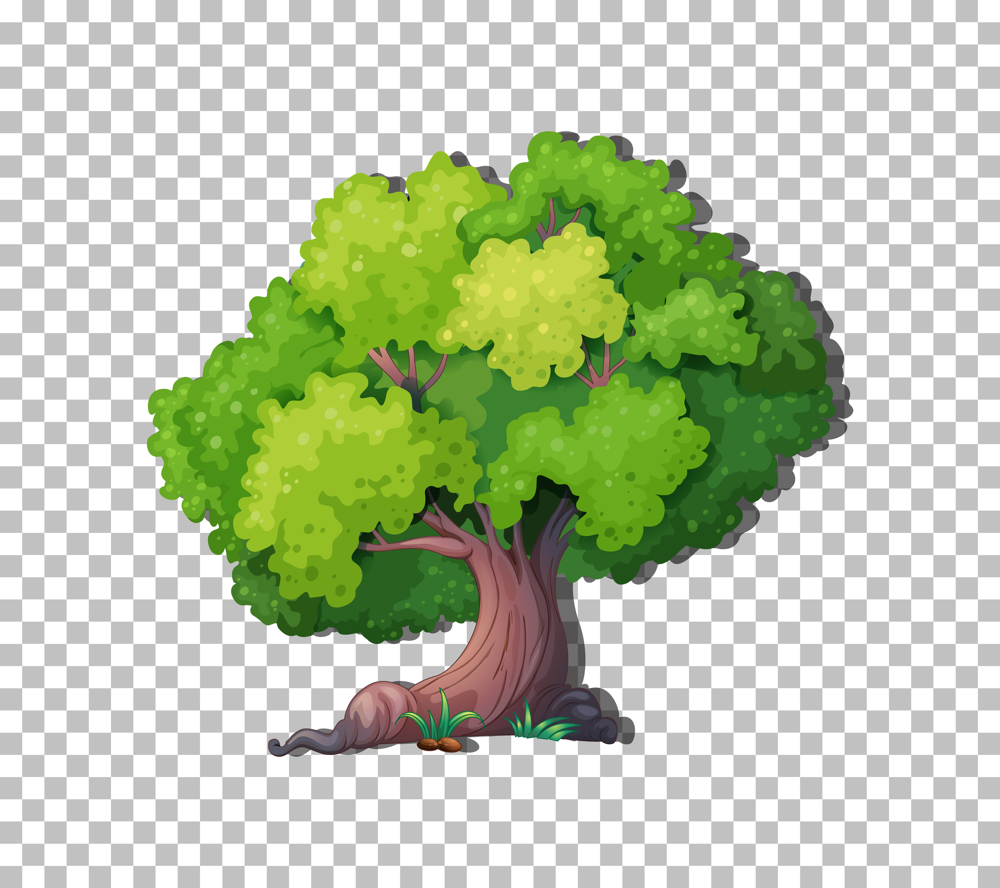

<h1 align="center">Assalamu Alaikum👋, I'm Raquib</h1> 

<h3 align="left">Data Science Enthusiast Data Research & Analyst  ||  NLP researcher.   Extended experience in Forex & Stock market analysis</h3>

<!-- Image floated to the right -->

  

<!-- Profile views badge -->

  

<!-- Text content -->
<ul style="clear: both;">
  <li>🔭 -- I’m currently working on <strong>Sentiment Analysis [Researching]</strong></li>
  <li>🌱 -- I’m currently learning <strong>Data Research & Analysis [NLP, Transformer Models]</strong></li>
  <li>👯 -- I’m looking to collaborate on <strong>Forex & Stock Market Analysis</strong></li>
  <li>🤝 -- I’m looking for help with <strong>research in Natural Language Processing (NLP)</strong></li>
  <li>📫 -- How to reach me: <strong>raquib3255@gmail.com</strong></li>
</ul>

  
  
  
  
  
  
  
  
  

 

 

<h3 align="left">Connect with me:</h3>

 

<h3 align="left">Languages and Tools:</h3>

  &nbsp;&nbsp;&nbsp;

  
  
  &nbsp;&nbsp;&nbsp;
  
  &nbsp;&nbsp;&nbsp;

  &nbsp;&nbsp;&nbsp;

  &nbsp;&nbsp;&nbsp;
  
  &nbsp;&nbsp;&nbsp;

  &nbsp;&nbsp;&nbsp;

  &nbsp;&nbsp;&nbsp;

  &nbsp;&nbsp;&nbsp;

  &nbsp;&nbsp;&nbsp;

  &nbsp;&nbsp;&nbsp;

  &nbsp;&nbsp;&nbsp;

  &nbsp;&nbsp;&nbsp;

  &nbsp;&nbsp;&nbsp;

  &nbsp;&nbsp;&nbsp;

  &nbsp;&nbsp;&nbsp;

  &nbsp;&nbsp;&nbsp;

&nbsp;

